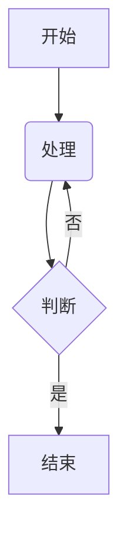

# 费曼学习平台 · 前端（feynman-platform-frontend）

基于 **React + Vite** 构建的费曼学习平台前端应用，对应课程第四次～第六次课内容：前端骨架搭建 → 前后端联调 → 知识点模块与富文本渲染。

## 技术栈

| 分类 | 技术 | 用途 |
|---|---|---|
| 框架 | React 19 | 组件化 UI、数据驱动视图 |
| 构建工具 | Vite | 开发服务器、打包构建 |
| 路由 | react-router-dom | 客户端路由（SPA 页面跳转） |
| 网络请求 | axios | 封装 apiClient，统一携带 token |
| 状态管理 | React Context API | 全局登录状态（token） |
| Markdown 编辑 | @uiw/react-md-editor | 知识点内容编辑 |
| Markdown 渲染 | react-markdown + remark-gfm | 安全渲染 Markdown（含表格等扩展语法） |
| 数学公式 | remark-math + rehype-katex | 渲染 LaTeX 公式（如 $E=mc^2$） |
| 图表 | mermaid | 渲染流程图等（由 ```mermaid 代码块触发） |
| 安全 | DOMPurify | 对 Mermaid 生成的 SVG 消毒，防 XSS |

## 目录结构

```
feynman-platform-frontend/
├── index.html                    # 入口 HTML（React 挂载到 #root）
├── vite.config.js                # Vite 配置（React 插件、端口 5173）
├── package.json                  # 项目依赖与脚本
└── src/
    ├── main.jsx                  # 入口：BrowserRouter + AuthProvider + App
    ├── App.jsx                   # 路由配置（公共路由 + 受保护路由）
    ├── index.css                 # 全局基础样式
    ├── api/
    │   └── axios.js              # axios 实例：baseURL + token 请求拦截器
    ├── context/
    │   └── AuthContext.jsx       # 全局认证上下文（token / login / logout）
    ├── components/
    │   ├── Layout.jsx            # 通用布局（导航栏 + Outlet）
    │   ├── ProtectedRoute.jsx    # 路由守卫（未登录 → /login）
    │   ├── MarkdownRenderer.jsx  # Markdown/GFM/LaTeX/Mermaid 统一渲染
    │   └── MermaidRenderer.jsx   # Mermaid 图表渲染（SVG + DOMPurify 消毒）
    └── pages/
        ├── LoginPage.jsx         # 登录页（对接 POST /api/users/login）
        ├── RegisterPage.jsx      # 注册页（对接 POST /api/users/register）
        ├── DashboardPage.jsx     # 主页：知识点列表 + 删除
        └── KnowledgePointFormPage.jsx  # 新建/编辑知识点（Markdown 编辑器）
```

## 快速开始

前置条件：后端 `feynman-platform-backend` 已启动（默认 `http://localhost:3000`）。

```bash
# 1. 安装依赖
npm install

# 2. 启动开发服务器（默认 http://localhost:5173）
npm run dev

# 3. 生产构建（输出到 dist/）
npm run build
```

## 页面路由

| 路径 | 页面 | 是否需要登录 |
|---|---|---|
| `/login` | 登录 | 否 |
| `/register` | 注册 | 否 |
| `/` | 知识点列表（主页） | 是（路由守卫保护） |
| `/kp/new` | 新建知识点 | 是 |
| `/kp/edit/:id` | 编辑知识点 | 是 |

## 与后端的对接约定

- **基础路径**：`http://localhost:3000/api`（见 `src/api/axios.js`，后端已开启 CORS）
- **认证方式**：登录/注册成功后后端返回 `{ token }`，由 `AuthContext` 存入 `localStorage`；axios 请求拦截器自动为每个请求附加 `x-auth-token` 请求头
- **注册字段**：`name` / `email` / `password`（与后端 User 模型字段一致）
- **刷新保持登录**：token 从 `localStorage` 初始化，刷新页面不掉线
- **退出登录**：清除全局 token（含 `localStorage`）并跳转登录页

## 富文本渲染能力

在知识点内容中可直接书写：

````markdown
# Markdown 标题、**加粗**、表格等（GFM 扩展语法）

行内公式：$E=mc^2$

块级公式：
$$
\int_a^b f(x) dx = F(b) - F(a)
$$


````

渲染安全性说明：react-markdown 默认不渲染原始 HTML 标签（`<script>` 等会被过滤）；Mermaid 生成的 SVG 额外经 DOMPurify 消毒，双重保险防 XSS。

## 常见问题

1. **页面能打开但接口报错**：检查后端是否已启动、`.env` 的数据库连接是否正确。
2. **登录后刷新被踢回登录页**：检查浏览器是否禁用了 `localStorage`。
3. **跨域报错（CORS）**：确认后端 `index.js` 中已启用 `app.use(cors())` 并重启后端。
